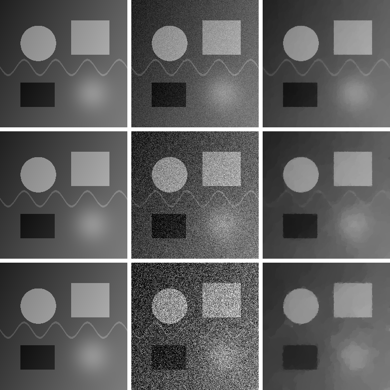

# NumPy TV 图像去噪实验

本项目使用 **PDHG（Primal-Dual Hybrid Gradient，原始-对偶混合梯度）** 求解 ROF 各向同性 TV 去噪模型：

$$
\min_u \frac{1}{2}\lVert u-f\rVert_2^2 + \lambda\sum_{i,j}\sqrt{(D_xu)_{i,j}^2+(D_yu)_{i,j}^2}.
$$

- $f$：加入高斯噪声后的观测图像
- $u$：需要恢复的干净图像
- 第一项：要求恢复结果接近观测图像
- TV 项：抑制剧烈变化，同时尽量保留边缘
- $\lambda$（代码中的 `weight`）：越大则平滑越强

算法和 SSIM 只用 NumPy 实现；PNG 文件由 Python 标准库直接编码，不使用深度学习框架或额外绘图库。

## 环境与运行

建议使用 Python 3.9 或更高版本：

```bash
python -m pip install -r requirements.txt
python denoise_tv.py
```

运行后会：

1. 用 NumPy 生成一张灰度测试图；
2. 分别加入 $\sigma=10/25/50$（8-bit 像素单位）的高斯噪声；
3. 分别用 PDHG 求解 TV 去噪模型；
4. 在终端打印三组噪声图和去噪图的 PSNR/SSIM；
5. 在当前目录生成 `denoise_result.png`。

对比图每行对应一个噪声强度（从上到下为 $\sigma=10/25/50$），每行从左到右依次为：**原图、噪声图、TV-PDHG 去噪图**。指标也保存在 PNG 的 `Description` 元数据中。

## 实验结果（默认参数，seed=42）

| 噪声 $\sigma$ | 噪声 PSNR (dB) | 噪声 SSIM | 去噪 PSNR (dB) | 去噪 SSIM |
|---:|---:|---:|---:|---:|
| 10 | 28.11 | 0.4498 | 41.40 | 0.9852 |
| 25 | 20.30 | 0.1500 | 35.74 | 0.9566 |
| 50 | 14.66 | 0.0565 | 31.41 | 0.9316 |



程序还带有 25 dB 门槛检查：去噪结果低于 25 dB 时会抛出异常并返回失败状态。

## 可调参数

```bash
python denoise_tv.py --noise-sigmas 10 25 50 --iterations 500 --seed 42
```

常用参数：

- `--noise-sigmas`：一组高斯噪声标准差（0–255 像素单位）
- `--weight`：手动指定 TV 正则化强度；省略时按噪声强度自动选择
- `--iterations`：PDHG 迭代次数
- `--seed`：随机种子，保证结果可复现
- `--output`：输出图片路径

## 文件说明

- `denoise_tv.py`：测试图生成、PDHG、PSNR/SSIM 和结果绘制
- `requirements.txt`：运行依赖
- `denoise_result.png`：运行后生成的三图对比结果
